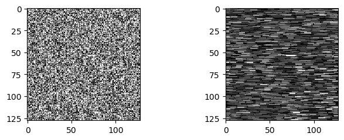

## Download

Download the current files for Windows and Linux [here](https://github.com/ericwait/hydra-image-processor/releases).

## Requirements

### Windows

* Nvidia graphics card ([compute capability](https://developer.nvidia.com/cuda-gpus#compute) 3.5 or better)
* MATLAB 2018 or newer
* The latest [Graphics driver](https://www.nvidia.com/Download/index.aspx)

### MacOS

_Currently unsupported._

## Using Hydra with MATLAB

1. Download the MATLAB zip file from the [download](#download) link above.
2. Unzip the files.
3. Place all folders with the + (plus) symbol in your MATLAB folder
    * Windows: `C:\Users\username\Documents\MATLAB)`
    * Linux: `/home/username/Documents/MATLAB`
4. Open MATLAB
5. Check if Hydra is loaded by running:

```matlab
dev = HIP.Cuda.DeviceStatus()
```

## Using Hydra with Python

1. Download the source zip file from the [download](#download) link above.
2. Unzip the files.
3. Navigate to the `src/Python` folder.
4. Copy the `HIP.lib` or `HIP.so` to a location where you can import into python
5. Check if Hydra is loaded by running:

```python
import HIP
dev = HIP.Cuda.DeviceStats()
print(dev)
```

## Setting up VSCode for Development

1. Install python and conda
2. Create virtual environment from environment.yml. `conda env create -f src/python/environment.yml`
3. Activate environment `conda activate hydra`
4. Configure the project with cmake
    * **Windows** - change `C:\Users\EricWait\git\programming\hydra-image-processor` with where you cloned the project to.

    ```shell
    C:\Program Files\CMake\bin\cmake.exe" --no-warn-unused-cli -DCMAKE_EXPORT_COMPILE_COMMANDS:BOOL=TRUE -Sc:/Users/EricWait/git/programming/hydra-image-processor -Bc:/Users/EricWait/git/programming/hydra-image-processor/build -G "Visual Studio 16 2019" -T host=x64 -A x64
    ```

    * **Linux** - change `/home/ewait/git/programming/_core/hydra-image-processor` with the path that you cloned the project to.

    ```shell
    /usr/bin/cmake --no-warn-unused-cli -DCMAKE_EXPORT_COMPILE_COMMANDS:BOOL=TRUE -DCMAKE_BUILD_TYPE:STRING=Release -DCMAKE_C_COMPILER:FILEPATH=/usr/bin/clang -DCMAKE_CXX_COMPILER:FILEPATH=/usr/bin/clang++ -S/home/ewait/git/programming/_core/hydra-image-processor -B/home/ewait/git/programming/_core/hydra-image-processor/build -G Ninja
    ```

5. Use [CMake Tools](https://marketplace.visualstudio.com/items?itemName=ms-vscode.cmake-tools) extension to build all projects. I recommended that you build in `Release` mode, so you don't need the debug libraries for python.
6. To test that the build worked, run `python src/Python/test_nonchunk.py`. You should get the following output `(1, 1, 12, 128, 128)` with no errors.
    1. In a windowing environment, you will also see 

## Happy coding!
